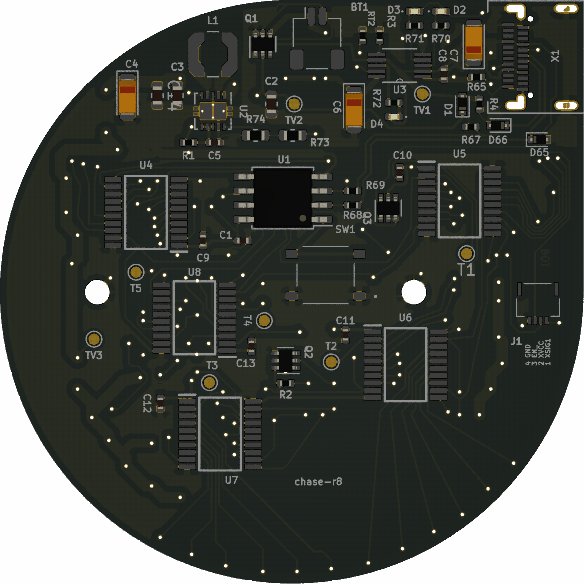
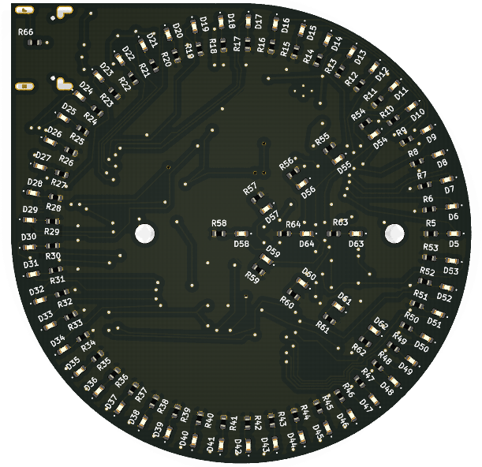

# chase-badge

Designed using [KiCad](https://kicad-pcb.org/).

I tried to follow datasheet recommendations and tried to base the design on application note schematics and PCB layouts of the active components.

First revision of the board in the repo is rev-8. Earlier revisions are not available in this repo.

Schematics contain notes and all components should have their datasheet in their details in KiCAD.

### Kudos

- to [@smcatala](https://github.com/smcatala) for reviewing the designs!

### Connectors

1. USB-C for power, charging and with bootloader programming.
2. FPC 4-pin for add-on boards.
3. Li-Po JST-SH 2-pin.

### Used ICs

##### ATTINY85V-20SU

- Chosen over ATTINY85V-10SU so we may support [bit-banged USB protocol](https://www.obdev.at/products/vusb/index.html) for programming the badge only with a USB cable. [datasheet](http://ww1.microchip.com/downloads/en/DeviceDoc/atmel-2586-avr-8-bit-microcontroller-attiny25-attiny45-attiny85_datasheet.pdf).

##### TLC6C9512PWR shift register

Chosen for low power consumption and low parts count. [datasheet](http://www.ti.com/lit/ds/symlink/tlc6c5912.pdf).

#### TPS63000 buck-boost regulator

[datasheet](http://www.ti.com/lit/ds/symlink/tps63000.pdf)

#### MCP73837-FCI_UN battery charge manager

[datasheet](http://ww1.microchip.com/downloads/en/DeviceDoc/20002071C.pdf)

### Tested

- Programming ATtiny85 with [Tiny AVR Programmer](https://www.sparkfun.com/products/11801)
- ATtiny85, TLC6C9512 and LEDs can work as expected when powered externally
- 3.3V or 5V is supported.

### Untested

- Power regulator
- Battery charge manager
- XSIG1 external signal, for supporting a buzzer, microphone etc.
- USB bootloader and programming from USB cable.

### TODO

1. Test everything under "untested" above.
2. Determine Li-Po battery size.

### PCB renders of rev-8

Note that some footprints are missing from the renders.

